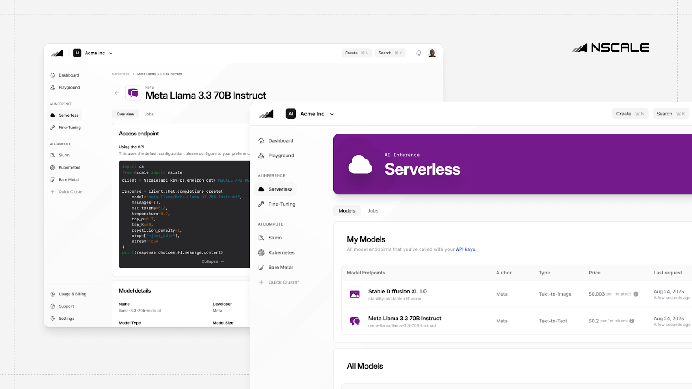

| [Platform](https://console.nscale.com/auth/signup) | [Docs](https://docs.nscale.com/docs/getting-started/overview) | [Blog](https://www.nscale.com/blog) |
|:----------:|:-------------:|:-----------:|

# Nscale-cookbooks

Welcome to Nscale's go-to place for developers to share, learn, and collaborate on recipes for making the most out of large language models (LLMs). Whether you're inferring, optimising, or simply experimenting with LLMs, this repository will provide helpful guides designed to help developers build with SOTA LLM using [Nscale Serverless Inference](https://console.nscale.com/auth/signup).

## Get Started

[Get up and running](https://docs.nscale.com/docs/getting-started/quickstart) with Nscale's serverless inference models in just a few steps. This guide will walk you through signing up, adding credit to your account, and making your first API call to start leveraging the power of our AI models.

## Contributing

We welcome contributions of all kinds—from complete recipes to quick tips. If you have a cookbook you'd like to add, [please reach out to us](https://nscale.canny.io/ideas) or fork the repo and create a pull request!

Got questions? Found a bug? Or just want to share some LLM insights? Open an issue, submit a feature request or join the conversation over in our [ideas forum](https://nscale.canny.io/ideas).

And hey, don't forget to star 🌟 this repo if you find it helpful!

## API Key

To make the most of the examples in this cookbook, you'll need an Nscale Serverless Inference API key ([sign up for free here](https://console.nscale.com/auth/signup)).

## Cookbooks

| Cookbook | Description |
|:----------:|:-------------:|
| **Category Name (e.g., Inference)** | |
| [Link to Cookbook](#) | Description of Cookbook |

## Learn More

Looking for more resources to enhance your experience with LLM models? Check out these helpful links:

- [About Nscale Serverless Inference](https://www.nscale.com/product/serverless)
- [Nscale Serverless Inference Documentation](https://docs.nscale.com/docs/getting-started/overview)
- [Nscale API Reference](https://docs.nscale.com/api-reference/inferencing/list-models)
- [Contact Support](help@nscale.com)

